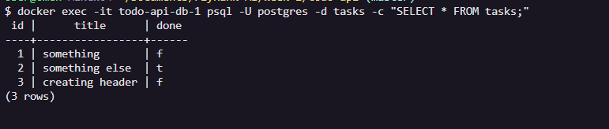
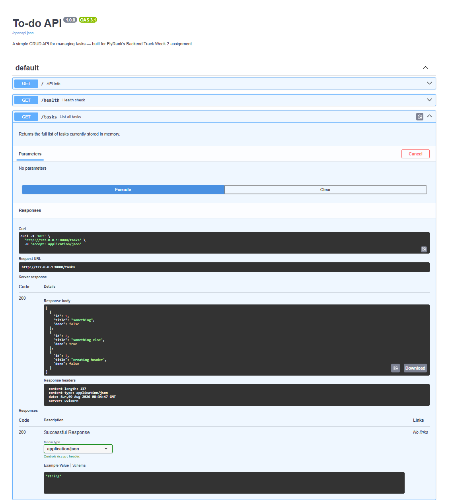

# Todo API

A simple CRUD API for managing tasks, built with FastAPI. Built as part of FlyRank's Backend Engineering Track — Week 2 (in-memory CRUD), Week 3 (SQLite persistence), and this assignment (containerized Postgres).

## What this is

A backend REST API that lets you create, read, update, and delete tasks. Data is stored in a **PostgreSQL database running in Docker**, and the entire stack — app + database — starts with a single command. This replaced the SQLite file from the previous stage: same API, same endpoints, now backed by a real database server instead of a single file on disk.

## How to run it

1. Clone this repo and navigate into it:
   ```bash
   git clone https://github.com/daniyal-devx/todo-api.git
   cd todo-api
   ```

2. Copy the example environment file:
   ```bash
   cp .env.example .env
   ```

3. Start the whole stack — app and database — with one command:
   ```bash
   docker compose up
   ```

   This builds the app's image, starts a Postgres container, waits for Postgres to report healthy, then starts the API. On first run it automatically creates the `tasks` table and seeds it with 3 example tasks.

4. Open your browser to `http://localhost:8000/docs` to see the interactive Swagger UI.

5. To stop everything: `Ctrl+C`, then `docker compose down` (add `-v` if you also want to wipe the database volume).

### Environment variables

Set in `.env` (see `.env.example`):

| Variable       | Description                                                              |
|----------------|---------------------------------------------------------------------------|
| `DATABASE_URL` | Postgres connection string (used when running locally, outside Docker)   |

When running via `docker compose up`, `DATABASE_URL` is set automatically inside `compose.yaml` to point at the `db` service — the `.env` value is only used if you run the app directly on your machine without Docker.

## Database

- **Engine:** PostgreSQL 18, running in a Docker container — not installed on the host machine at all.
- **Persistence:** a named Docker volume (`taskdata`) stores the actual database files outside the container, so data survives `docker compose down` / `docker compose up` cycles, and even full container removal.
- **Connection:** the app connects via `psycopg` (the standard Python driver for Postgres) using a connection string from `DATABASE_URL`. Inside Docker Compose, the app reaches the database at host `db` (the service name) rather than `localhost`, since each container is its own isolated network namespace.
- **How to inspect it:** with the stack running, open a SQL prompt directly inside the database container:
  ```bash
  docker exec -it todo-api-db-1 psql -U postgres -d tasks -c "SELECT * FROM tasks;"
  ```

### Database screenshot



## Endpoints

| Method | Path          | Description                             | Success | Errors    |
|--------|---------------|------------------------------------------|---------|-----------|
| GET    | `/`           | API info                                 | 200     | -         |
| GET    | `/health`     | Health check (verifies DB connection)    | 200     | 503       |
| GET    | `/tasks`      | List all tasks                           | 200     | -         |
| POST   | `/tasks`      | Create a new task                        | 201     | 400       |
| GET    | `/tasks/{id}` | Get a single task by id                  | 200     | 404       |
| PUT    | `/tasks/{id}` | Replace a task's title and done status   | 200     | 404, 400  |
| DELETE | `/tasks/{id}` | Delete a task by id                      | 204     | 404       |

All endpoints behave identically across every storage swap — in-memory (Week 2), SQLite (Week 3), and now Postgres in Docker. Same requests, same responses, same status codes. Only the storage layer underneath ever changes.

## Example request

```bash
curl -i -X POST http://localhost:8000/tasks -H "Content-Type: application/json" -d '{"title":"Test Postgres CRUD"}'
```

```
HTTP/1.1 201 Created
content-type: application/json

{"id":4,"title":"Test Postgres CRUD","done":false}
```

## Swagger UI

Full CRUD cycle tested via `/docs`.



## Notes

- Data is stored in PostgreSQL, running in Docker, and survives both app restarts and full stack teardowns (`docker compose down` / `up`).
- All SQL queries use parameterized placeholders (`%s`, the psycopg style) — no user input is ever glued directly into a SQL string, which is what keeps the database safe from injection.
- `title` is validated on both create and update: missing or empty (including whitespace-only) titles return a 400 with a clear error message, handled manually rather than relying on FastAPI's default 422 validation error.
- The database password lives only in `.env` (git-ignored) — never hardcoded in code or committed to this repo. `.env.example` documents which variable to set without exposing a real secret.

## Persistence proof

After creating tasks and running `docker compose down` followed by `docker compose up` — a full teardown and restart of both containers, not just the app — `GET /tasks` still returned the exact same rows, with no re-seeding. This is because the Postgres data lives in the `taskdata` Docker volume, which exists independently of the containers themselves. Removing and recreating the containers doesn't touch the volume, so the data survives.

## Extras

- **Real health check:** `GET /health` runs `SELECT 1` against the database and reports `db: "ok"` on success, or `503` with `db: "unreachable"` if the database can't be reached. This is the same pattern real load balancers use to decide whether to route traffic to an instance.

## AI vs Me — Containerizing Postgres (Stage 6)

### My prompt (first attempt, written from memory)

> "I want you to containerize a CRUD API onto postgres your path should be using python, psycopg and the tasks table and the seed once on empty rule at startup it should also follow that with the same five endpoints and their same behaviour like same exceptional rules as before and it should consist parameterized queries and password of like db should never be hardcoded it should always load it from .env and a specific volume for persistence and one command startup via docker compose up"

### What it did better

Nothing outperformed my own implementation — the gaps below were all things I already had right in my hand-built version.

### What it got wrong or quietly ignored

1. **Flat error responses**, e.g. `{"detail": "Task not found"}`, instead of my nested `{"detail": {"error": "..."}}` shape. My prompt said "same exceptional rules as before," but "before" only means something to me — the AI has no access to that context, so it fell back to FastAPI's plain default.
2. **Whitespace-only titles were not rejected.** It checked `if not task.title:`, which only catches a fully empty string — the same gap that showed up in my Week 2 rematch too.
3. **PUT didn't strictly require both fields.** Its `Task` model gave `done` a default value (`done: bool = False`), so a `PUT` request could technically omit `done` and it would silently default instead of being rejected — my own version treats PUT as a strict full replacement.
4. **No healthcheck in `compose.yaml`.** This is the exact startup-race bug I hit and had to fix myself in Stage 4 (`api` trying to connect before Postgres finished initializing) — the AI's compose file has no `condition: service_healthy`, so a fresh clone would likely hit the same crash I did.
5. **Different Postgres version and volume path** — `postgres:15` with `/var/lib/postgresql/data`, instead of the `postgres:18` / `/var/lib/postgresql` combination I had to work out myself after a real version-compatibility crash in Stage 0.

### What my prompt forgot to specify

- The exact error response shape
- That whitespace-only titles count as invalid, not just empty ones
- That PUT must require both `title` and `done`, with no defaults
- A healthcheck requirement on the `db` service before the app connects
- A specific Postgres version or volume mount path

### The rematch

Tightened prompt:

> "Containerize a task CRUD API onto Postgres, using Python, FastAPI, and psycopg. Table `tasks` with columns `id` (serial primary key), `title` (text, not null), `done` (boolean, default false). On startup, create the table if missing and seed 3 example tasks only if the table is empty. Implement these 5 endpoints with these exact behaviors: `GET /tasks` (200, list all), `GET /tasks/{id}` (200 or 404), `POST /tasks` (201, or 400 if title is missing/empty/whitespace-only), `PUT /tasks/{id}` (200, full replace — both title and done are required, 400 if title invalid, 404 if id doesn't exist), `DELETE /tasks/{id}` (204, or 404). All error responses must use the shape `{"error": "message"}`. Use parameterized queries (`%s`). Database password must come from a `.env` file via `python-dotenv`, never hardcoded. Use a named Docker volume for Postgres data persistence. Include a `Dockerfile` and `compose.yaml` with a `healthcheck` on the `db` service so the app waits for Postgres to be ready before connecting, not just started."

Naming the error shape, PUT's full-replace requirement, whitespace validation, and the compose healthcheck explicitly closes every gap the first version had — the same lesson from both earlier rematches, holding again here: an AI's output is only as precise as the spec it's given, and the same categories of gaps (error shape, PUT semantics, validation edge cases) keep recurring across every rematch I've done in this program, because they're exactly the kind of implicit conventions a spec-writer forgets to state out loud.

Both AI attempts are kept in `ai-version/`, separate from the hand-built Stage 0–5 code.

## AI vs Me — Week 3 (SQLite migration)

### My prompt

> I want you to now move my previous generated CRUD task API from an in memory to real database using SQLite.
>
> Your lane should be Python/FastAPI and for SQLite use the sqlite3 library, with the same three columns in the table tasks: id, title, done.
>
> At startup it should look if the table is missing then create the table, and seed three tasks if and only if the table is empty.
>
> Also the five endpoints previously associated with the in-memory list should now work with the SQLite db file, and also give exceptions same as before, like 400/404.
>
> Also use parameterized queries for safety purposes. Now generate that.

### What it did better

1. **Used a `@contextmanager` for connections** instead of repeating `connect()` / `commit()` / `close()` in every route. One `get_connection()` function, reused everywhere with `with get_connection() as conn:`. This also wraps the connection in a `try/finally`, so it closes even if an error happens mid-request — my version would leak an open connection if an exception hit between opening it and the manual `conn.close()` call.
2. **Used `response_model=Task`** (a Pydantic model) on every route instead of returning hand-built dicts. This makes FastAPI validate and document the exact response shape, and gives cleaner Swagger docs.
3. Added `AUTOINCREMENT` to the primary key for a stricter guarantee against id reuse — a defensible extra I hadn't considered.

### What it got wrong or quietly ignored

1. **PUT became a partial update, not a full replace.** I confirmed this by sending `PUT /tasks/1` with only `{"done": true}` — no `title`. It returned `200 OK` with the old title silently preserved, instead of rejecting the request or requiring both fields. My own implementation (and the assignment spec) treats PUT as a full replacement: both `title` and `done` are required every time. This is the exact same gap the AI made in my Week 2 rematch too — it seems to be a default assumption AI models make about PUT unless explicitly told otherwise.
2. **Error response shape doesn't match mine.** Mine: `{"detail": {"error": "Task not found"}}` (nested). The AI's: `{"detail": "Task not found"}` (flat string). My prompt said to match "400/404... same as before" but never specified the exact JSON shape, so it picked FastAPI's plainer default instead of my nested format.

### What my prompt forgot to specify

- The exact error response shape (`{"detail": {"error": "..."}}` vs a flat string)
- Whether PUT should require both fields (full replace) or allow partial updates
- Whether connections should be opened per-route manually or through a shared helper like a context manager — the AI made its own (arguably better) call here since I left it open

### The rematch

I tightened the prompt to explicitly require: PUT must require both `title` and `done` in every request (400 if either is missing), and all error responses must use the shape `{"detail": {"error": "message"}}`. I regenerated and tested both fixes directly:

- `PUT /tasks/1` with only `{"done": true}` (no title) now correctly returns `400 Bad Request` instead of silently succeeding.
- `GET /tasks/999` now returns the nested shape `{"detail": {"error": "Task with id 999 not found"}}`, matching my own API exactly.

Both issues were fully resolved by specifying them explicitly — confirming the core lesson: an AI's output is only as precise as the spec it's given, and the same silent assumption (partial PUT) showed up twice across two separate rematches, both times because I hadn't ruled it out in the prompt. The rematch version also solved the "both required" rule in an unusual way — it bypassed Pydantic's automatic body validation for that route and parsed the raw JSON manually instead, giving it exact control over which fields to require. A reasonable approach, though it trades away some of Pydantic's built-in type validation to do it.

Both AI attempts (first pass and rematch) are kept in `ai-version-w3/`, separate from my own hand-built Stage 0–5 code. The full diff between my implementation and the AI's first attempt is saved at `ai-version-w3/diff.txt`.

## AI vs Me — Week 2 (in-memory CRUD)

### My original prompt

> You act as a professional backend ai engineer have to build a curd to-do api you have to use pydantic and fast api frameworks and build the api in python like fastapi swagger ui it should have 5 endpoints get / ,get /tasks , get /tasks {id}, post /tasks, put /tasks/{id}, delete /tasks/{id} and with some explicit status codes like if someone gives unknown id or task title empty during some post , put then some explicit status code with some detail it should use in memory storage.

### What the AI did better

Nothing meaningfully outperformed my own implementation — the AI's first attempt was functional but less strict than mine in the places that actually mattered for this assignment (validation, PUT semantics).

### What it got wrong or quietly ignored

1. **Whitespace-only titles were not rejected.** The AI checked `if not task.title:`, which only catches empty strings — a title of `"   "` passed validation and got saved as a task, unlike my own API which strips whitespace before checking.
2. **PUT behaved as a partial update (PATCH), not a full replacement.** My prompt never said whether `PUT` should require both `title` and `done` or allow either to be omitted. The AI defaulted to making both fields optional, silently preserving the old value for any field the client didn't send — a reasonable design choice, but not what REST convention (or my own hand-built version) intends for `PUT`.
3. **Swagger UI showed generic default labels** ("Read Root," "Get Tasks") instead of descriptive summaries, and error responses used a flat string (`"detail": "Title is required"`) instead of my nested `{"detail": {"error": "..."}}` format.

### What my prompt forgot to specify

I never stated the exact status codes to use, that whitespace-only titles count as empty, or whether `PUT` should require both fields. The AI made reasonable-but-different calls on each of these gaps — proof that a vague spec produces a working API, just not the *same* API.

### The rematch

I rewrote the prompt to explicitly require: rejecting whitespace-only titles (not just empty ones), requiring both `title` and `done` on every `PUT` request, and adding descriptive Swagger summaries to each endpoint. Regenerating from this tightened prompt fixed all three issues — the AI's output now matched my own API's behavior exactly.
