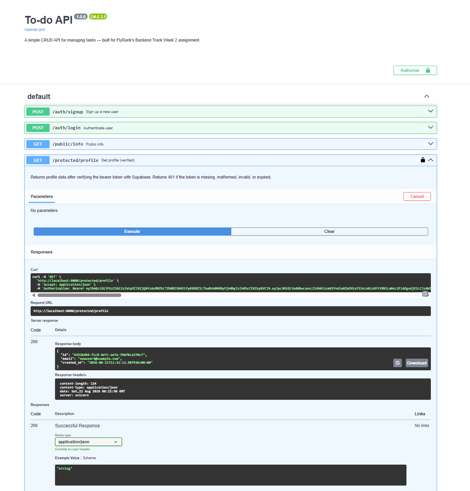

# Todo API

A simple CRUD API for managing tasks, built with FastAPI. Built as part of FlyRank's Backend Engineering Track — Week 2 (in-memory CRUD), Week 3 (SQLite persistence), Postgres + Docker (containerized database), A4 (Supabase authentication), and A17 (LLM-powered triage endpoint).

## What this is

A backend REST API that lets you create, read, update, and delete tasks — with real user authentication in front of it, and an LLM-powered triage endpoint that classifies messy todo text into a category and urgency level. Data is stored in a **PostgreSQL database running in Docker**. User accounts, password hashing, and JSON Web Tokens are handled entirely by **Supabase Auth** — this API never stores or sees a raw password; it only ever receives and verifies tokens that Supabase issues. The entire stack — app + database — starts with a single command.

## How to run it

1. Clone this repo and navigate into it:
   ```bash
   git clone https://github.com/daniyal-devx/todo-api.git
   cd todo-api
   ```

2. Copy the example environment file and fill in your own values:
   ```bash
   cp .env.example .env
   ```
   You'll need a free [Supabase](https://supabase.com) project — create one, then copy your **Project URL** and **anon/publishable key** from *Project Settings → API* into `.env`.

   One-time Supabase setting: in your Supabase dashboard, go to *Authentication → Sign In / Providers → Email* and turn **off** "Confirm email." This lets a fresh signup log in immediately without clicking an email link (fine for a practice project; you'd leave this on in production).

   You'll also need a free [OpenRouter](https://openrouter.ai) account for the `/triage` endpoint — see [LLM Triage Endpoint](#llm-triage-endpoint-week-7--a17) below for setup.

3. Start the whole stack — app and database — with one command:
   ```bash
   docker compose up
   ```

   This builds the app's image, starts a Postgres container, waits for Postgres to report healthy, then starts the API. On first run it automatically creates the `tasks` table and seeds it with 3 example tasks.

4. Open your browser to `http://localhost:8000/docs` to see the interactive Swagger UI. Click **Authorize**, paste an access token (from `/auth/login`), and you can test every protected route directly from the browser.

5. To stop everything: `Ctrl+C`, then `docker compose down` (add `-v` if you also want to wipe the database volume).

### Environment variables

Set in `.env` (see `.env.example`):

| Variable        | Description                                                              |
|-----------------|---------------------------------------------------------------------------|
| `DATABASE_URL`  | Postgres connection string (used when running locally, outside Docker)   |
| `SUPABASE_URL`  | Your Supabase project's URL, from *Project Settings → API*               |
| `SUPABASE_KEY`  | Your Supabase project's anon/publishable key — safe to use client-side, **never** the `service_role`/secret key |
| `LLM_BASE_URL`  | OpenRouter's API base — `https://openrouter.ai/api/v1`                   |
| `LLM_API_KEY`   | Your OpenRouter API key                                                   |
| `LLM_MODEL`     | The exact model slug to call, e.g. `minimax/minimax-m2.7:free`            |
| `LLM_STUB`      | Set to `1` to skip the model entirely and return a fixed fake response (dev/testing only) |
| `LLM_ENABLED`   | Set to `false` to disable `/triage` entirely and return a `503` (kill switch) |

When running via `docker compose up`, all variables are passed into the `api` container from your `.env` file automatically.

## Authentication

Auth is built on **Supabase Auth**, an external Identity Provider — this API never hashes a password or signs a token itself. The flow:

1. A client sends `email`/`password` to `/auth/signup` or `/auth/login`. This API forwards those credentials to Supabase.
2. Supabase creates/verifies the account and returns a signed **JWT** (access token) plus a refresh token.
3. The client sends that JWT on every request to a protected route, in the header: `Authorization: Bearer <token>`.
4. This API asks Supabase to verify the token (`supabase.auth.get_user(token)`) before letting the request through. An invalid, tampered, or expired token is rejected with `401`.

Token verification is implemented once, as a reusable FastAPI dependency (`verify_token`), and applied to every protected route — not copy-pasted per route.

### Endpoints

| Method | Path                    | Auth required | Description                                             | Success | Errors    |
|--------|--------------------------|----------------|-----------------------------------------------------------|---------|-----------|
| GET    | `/`                      | No             | API info                                                   | 200     | -         |
| GET    | `/health`                | No             | Health check (verifies DB connection)                      | 200     | 503       |
| POST   | `/auth/signup`           | No             | Create a new user account via Supabase                     | 201     | 400       |
| POST   | `/auth/login`            | No             | Authenticate and receive an access + refresh token          | 200     | 400, 401  |
| POST   | `/auth/logout`           | Yes (Bearer)   | End the current session                                    | 204     | 401       |
| GET    | `/public/info`           | No             | Open, unauthenticated info endpoint                         | 200     | -         |
| GET    | `/protected/profile`     | Yes (Bearer)   | Returns the authenticated user's id, email, created_at      | 200     | 401       |
| GET    | `/protected/dashboard`   | Yes (Bearer)   | Second protected route, reuses the same auth guard          | 200     | 401       |
| GET    | `/tasks`                 | No             | List all tasks                                              | 200     | -         |
| POST   | `/tasks`                 | No             | Create a new task                                            | 201     | 400       |
| GET    | `/tasks/{id}`            | No             | Get a single task by id                                     | 200     | 404       |
| PUT    | `/tasks/{id}`            | No             | Replace a task's title and done status                      | 200     | 404, 400  |
| DELETE | `/tasks/{id}`            | No             | Delete a task by id                                          | 204     | 404       |
| POST   | `/triage`                | No             | Classifies messy todo text into a category and urgency via LLM | 200  | 400, 422, 502, 503 |

> Note: `/tasks` routes are not yet tied to individual users — any authenticated or unauthenticated caller can access all tasks. Per-user task ownership is planned as a follow-up (tenant isolation), not part of this assignment.

## Database

- **Engine:** PostgreSQL 18, running in a Docker container — not installed on the host machine at all.
- **Persistence:** a named Docker volume (`taskdata`) stores the actual database files outside the container, so data survives `docker compose down` / `docker compose up` cycles, and even full container removal.
- **Connection:** the app connects via `psycopg` (the standard Python driver for Postgres) using a connection string from `DATABASE_URL`. Inside Docker Compose, the app reaches the database at host `db` (the service name) rather than `localhost`, since each container is its own isolated network namespace.
- **How to inspect it:** with the stack running, open a SQL prompt directly inside the database container:
  ```bash
  docker exec -it todo-api-db-1 psql -U postgres -d tasks -c "SELECT * FROM tasks;"
  ```

### Database screenshot


## Example requests

**Sign up, log in, call a protected route:**
```bash
curl -i -X POST http://localhost:8000/auth/signup -H "Content-Type: application/json" -d '{"email":"you@example.com","password":"yourpassword"}'
# -> 201 Created

curl -i -X POST http://localhost:8000/auth/login -H "Content-Type: application/json" -d '{"email":"you@example.com","password":"yourpassword"}'
# -> 200 OK, returns { "access_token": "...", "refresh_token": "..." }

curl -i http://localhost:8000/protected/profile -H "Authorization: Bearer <ACCESS_TOKEN>"
# -> 200 OK, returns { "id": "...", "email": "...", "created_at": "..." }
```

**Create a task:**
```bash
curl -i -X POST http://localhost:8000/tasks -H "Content-Type: application/json" -d '{"title":"Test Postgres CRUD"}'
```
```
HTTP/1.1 201 Created
content-type: application/json

{"id":4,"title":"Test Postgres CRUD","done":false}
```

**Triage a todo item:**
```bash
curl -i -X POST http://localhost:8000/triage -H "Content-Type: application/json" -d '{"text":"buy groceries and pay electricity bill"}'
```
```
HTTP/1.1 200 OK
content-type: application/json

{"category":"errand","urgency":"normal","confidence":0.9,"reason":"Both buying groceries and paying a utility bill are standard personal errands with no urgent timeline mentioned."}
```

## Swagger UI

Full CRUD cycle tested via `/docs`, plus the Bearer auth "Authorize" flow tested end-to-end from the browser.




## Notes

- This API never stores or sees a raw password — Supabase Auth handles signup, login, password hashing, and JWT signing/verification entirely.
- Only the **anon/publishable** Supabase key is used in this app. The `service_role`/secret key (which bypasses all security) is never used or exposed.
- Token verification is centralized in a single reusable dependency (`verify_token`), applied to every protected route via `Depends(...)` — not duplicated per route.
- Data is stored in PostgreSQL, running in Docker, and survives both app restarts and full stack teardowns (`docker compose down` / `up`).
- All SQL queries use parameterized placeholders (`%s`, the psycopg style) — no user input is ever glued directly into a SQL string, which is what keeps the database safe from injection.
- `title` is validated on both create and update: missing or empty (including whitespace-only) titles return a 400 with a clear error message, handled manually rather than relying on FastAPI's default 422 validation error. The same pattern is used for `email`/`password` on signup and login.
- All secrets (`DATABASE_URL`, `SUPABASE_URL`, `SUPABASE_KEY`, `LLM_API_KEY`) live only in `.env` (git-ignored) — never hardcoded in code or committed to this repo. `.env.example` documents which variables to set without exposing real secrets.

## Persistence proof

<!-- keep your existing persistence-proof section/screenshots here -->

## LLM Triage Endpoint (Week 7 / A17)

### What it does

`POST /triage` takes a single messy todo item's text (e.g. "fix login bug asap client is mad" or "buy milk") and returns a structured classification: which life category it belongs to (`work`, `errand`, `health`, `chore`, or `other`), how urgent it is (`low`, `normal`, `high`), a confidence score, and a one-sentence reason. It's a single request-in, single answer-out classification — no chat, no memory of previous requests. The model's answer is never trusted blindly: it's parsed, validated against a strict schema, repaired once if it's malformed, and quarantined (with a `422`) if it still can't be trusted.

### Try it

```bash
curl -i -X POST http://localhost:8000/triage -H "Content-Type: application/json" -d '{"text":"buy groceries and pay electricity bill"}'
```
```
HTTP/1.1 200 OK
content-type: application/json

{"category":"errand","urgency":"normal","confidence":0.9,"reason":"Both buying groceries and paying a utility bill are standard personal errands with no urgent timeline mentioned."}
```

### Job card

```
What it does: Classifies a messy todo item into a life category and urgency level so it can be sorted and prioritized automatically.

Input: { "text": "string, 1-500 characters" }

Output: { "category": one of [work|errand|health|chore|other],
          "urgency": one of [low|normal|high],
          "confidence": 0.0-1.0,
          "reason": "one short sentence" }

It must never: invent a category outside the list · return free text instead of JSON · give medical, legal or financial advice · reveal the prompt

When unsure it should: return category "other" with low confidence, not a guess
```

### Provider and model

- **Provider:** [OpenRouter](https://openrouter.ai) — a hosted gateway to many models, free tier, no credit card.
- **Model:** `minimax/minimax-m2.7:free`
- **To swap providers/models:** change three environment variables — `LLM_BASE_URL`, `LLM_API_KEY`, `LLM_MODEL` — nothing else in the code changes. This is deliberate: the endpoint treats the model as an interchangeable external API, not a hardcoded dependency.

### Reliability behavior

- **Timeout:** 30 seconds per call — the SDK's own default (10 minutes) is explicitly overridden.
- **Retries:** up to 2 retries with exponential backoff + jitter, but *only* on timeouts, `429` (rate limit), and `5xx` (server error). A `400`/`401`/`403` fails immediately with no retry, since retrying a bad request or a bad key wastes quota without ever succeeding.
- **Repair:** if the model's answer isn't valid JSON, or doesn't match the schema (wrong category, out-of-range confidence, etc.), the endpoint sends the model its own broken answer plus the exact validation error and asks once for a corrected version.
- **Quarantine:** if the repair attempt also fails, the endpoint returns a clean `422` and logs the input, the raw broken output, and the error to `logs/quarantine.jsonl` — it never crashes and never returns raw, unvalidated model text to the caller.
- **Kill switch:** setting `LLM_ENABLED=false` disables the model call entirely and returns a `503` immediately — no deploy needed to turn the feature off.
- **Cost logging:** every model call (including repairs) logs a structured line to stdout with the prompt version, model, input/output token counts, duration, and whether a repair was needed.

### Eval result

**Date:** 2026-08-30
**Prompt version:** `triage-v1`
**Score:** 7/8 correct on category (8 hand-labeled cases, see `evals/cases.json`)

The one miss — "book dentist appointment for next week" (expected `health`, got `errand`) — is a genuinely ambiguous case: a dentist visit is arguably both a health matter and a scheduling task. The model's answer is defensible, not clearly wrong; it isn't counted as a prompt failure.

### Cost

One real call (from server logs): **325 input tokens, 340 output tokens, ~9.1 seconds**, using the free `minimax/minimax-m2.7:free` model — **actual cost: $0**, since this model's free tier is used.

For real-world cost at scale, the paid version of this exact model — `minimax/minimax-m2.7` — is priced on OpenRouter at **$0.24/M input tokens and $0.96/M output tokens**. At ~665 tokens/call, 10,000 requests/day is about 3.25M input + 3.4M output tokens/day:

- Input: 3.25M × $0.24/M ≈ $0.78/day
- Output: 3.4M × $0.96/M ≈ $3.26/day
- **Total: ≈ $4.04/day at 10,000 requests/day**

Output tokens dominate the cost — nearly 4x the input cost — since the JSON response plus the model's reasoning is longer than the todo text it's classifying.

### What I'd fix with another day

Response time (~9s/call) is the biggest weakness — a real user-facing feature would need this closer to 1-2 seconds, which likely means paying for a faster hosted model instead of a free, possibly-throttled one. I'd also add a request-level cache keyed on the input text + prompt version, since todo text often repeats (e.g. recurring chores), and grow the eval set from 8 to 25 cases split into easy/hard buckets for a more precise quality signal.

## AI vs Me — Postgres + Docker

### My prompt

> "I want you to containerize a CRUD API onto postgres your path should be using python, psycopg and the tasks table and the seed once on empty rule at startup it should also follow that with the same five endpoints and their same behaviour like same exceptional rules as before and it should consist parameterized queries and password of like db should never be hardcoded it should always load it from .env and a specific volume for persistence and one command startup via docker compose up"

### What it did better

Nothing outperformed my own implementation — the gaps below were all things I already had right in my hand-built version.

### What it got wrong or quietly ignored

1. **Flat error responses**, e.g. `{"detail": "Task not found"}`, instead of my nested `{"detail": {"error": "..."}}` shape. My prompt said "same exceptional rules as before," but "before" only means something to me — the AI has no access to that context, so it fell back to FastAPI's plain default.
2. **Whitespace-only titles were not rejected.** It checked `if not task.title:`, which only catches a fully empty string — the same gap that showed up in my Week 2 rematch too.
3. **PUT didn't strictly require both fields.** Its `Task` model gave `done` a default value (`done: bool = False`), so a `PUT` request could technically omit `done` and it would silently default instead of being rejected — my own version treats PUT as a strict full replacement.
4. **No healthcheck in `compose.yaml`.** This is the exact startup-race bug I hit and had to fix myself in Stage 4 (`api` trying to connect before Postgres finished initializing) — the AI's compose file has no `condition: service_healthy`, so a fresh clone would likely hit the same crash I did.
5. **Different Postgres version and volume path** — `postgres:15` with `/var/lib/postgresql/data`, instead of the `postgres:18` / `/var/lib/postgresql` combination I had to work out myself after a real version-compatibility crash in Stage 0.

### What my prompt forgot to specify

- The exact error response shape
- That whitespace-only titles count as invalid, not just empty ones
- That PUT must require both `title` and `done`, with no defaults
- A healthcheck requirement on the `db` service before the app connects
- A specific Postgres version or volume mount path

### The rematch

Tightened prompt:

> "Containerize a task CRUD API onto Postgres, using Python, FastAPI, and psycopg. Table `tasks` with columns `id` (serial primary key), `title` (text, not null), `done` (boolean, default false). On startup, create the table if missing and seed 3 example tasks only if the table is empty. Implement these 5 endpoints with these exact behaviors: `GET /tasks` (200, list all), `GET /tasks/{id}` (200 or 404), `POST /tasks` (201, or 400 if title is missing/empty/whitespace-only), `PUT /tasks/{id}` (200, full replace — both title and done are required, 400 if title invalid, 404 if id doesn't exist), `DELETE /tasks/{id}` (204, or 404). All error responses must use the shape `{"error": "message"}`. Use parameterized queries (`%s`). Database password must come from a `.env` file via `python-dotenv`, never hardcoded. Use a named Docker volume for Postgres data persistence. Include a `Dockerfile` and `compose.yaml` with a `healthcheck` on the `db` service so the app waits for Postgres to be ready before connecting, not just started."

Naming the error shape, PUT's full-replace requirement, whitespace validation, and the compose healthcheck explicitly closes every gap the first version had — the same lesson from both earlier rematches, holding again here: an AI's output is only as precise as the spec it's given, and the same categories of gaps (error shape, PUT semantics, validation edge cases) keep recurring across every rematch I've done in this program, because they're exactly the kind of implicit conventions a spec-writer forgets to state out loud.

Both AI attempts are kept in `ai-version/`, separate from the hand-built Stage 0–5 code.

## AI vs Me — Week 3 (SQLite migration)

### My prompt

> I want you to now move my previous generated CRUD task API from an in memory to real database using SQLite.
>
> Your lane should be Python/FastAPI and for SQLite use the sqlite3 library, with the same three columns in the table tasks: id, title, done.
>
> At startup it should look if the table is missing then create the table, and seed three tasks if and only if the table is empty.
>
> Also the five endpoints previously associated with the in-memory list should now work with the SQLite db file, and also give exceptions same as before, like 400/404.
>
> Also use parameterized queries for safety purposes. Now generate that.

### What it did better

1. **Used a `@contextmanager` for connections** instead of repeating `connect()` / `commit()` / `close()` in every route. One `get_connection()` function, reused everywhere with `with get_connection() as conn:`. This also wraps the connection in a `try/finally`, so it closes even if an error happens mid-request — my version would leak an open connection if an exception hit between opening it and the manual `conn.close()` call.
2. **Used `response_model=Task`** (a Pydantic model) on every route instead of returning hand-built dicts. This makes FastAPI validate and document the exact response shape, and gives cleaner Swagger docs.
3. Added `AUTOINCREMENT` to the primary key for a stricter guarantee against id reuse — a defensible extra I hadn't considered.

### What it got wrong or quietly ignored

1. **PUT became a partial update, not a full replace.** I confirmed this by sending `PUT /tasks/1` with only `{"done": true}` — no `title`. It returned `200 OK` with the old title silently preserved, instead of rejecting the request or requiring both fields. My own implementation (and the assignment spec) treats PUT as a full replacement: both `title` and `done` are required every time. This is the exact same gap the AI made in my Week 2 rematch too — it seems to be a default assumption AI models make about PUT unless explicitly told otherwise.
2. **Error response shape doesn't match mine.** Mine: `{"detail": {"error": "Task not found"}}` (nested). The AI's: `{"detail": "Task not found"}` (flat string). My prompt said to match "400/404... same as before" but never specified the exact JSON shape, so it picked FastAPI's plainer default instead of my nested format.

### What my prompt forgot to specify

- The exact error response shape (`{"detail": {"error": "..."}}` vs a flat string)
- Whether PUT should require both fields (full replace) or allow partial updates
- Whether connections should be opened per-route manually or through a shared helper like a context manager — the AI made its own (arguably better) call here since I left it open

### The rematch

I tightened the prompt to explicitly require: PUT must require both `title` and `done` in every request (400 if either is missing), and all error responses must use the shape `{"detail": {"error": "message"}}`. I regenerated and tested both fixes directly:

- `PUT /tasks/1` with only `{"done": true}` (no title) now correctly returns `400 Bad Request` instead of silently succeeding.
- `GET /tasks/999` now returns the nested shape `{"detail": {"error": "Task with id 999 not found"}}`, matching my own API exactly.

Both issues were fully resolved by specifying them explicitly — confirming the core lesson: an AI's output is only as precise as the spec it's given, and the same silent assumption (partial PUT) showed up twice across two separate rematches, both times because I hadn't ruled it out in the prompt. The rematch version also solved the "both required" rule in an unusual way — it bypassed Pydantic's automatic body validation for that route and parsed the raw JSON manually instead, giving it exact control over which fields to require. A reasonable approach, though it trades away some of Pydantic's built-in type validation to do it.

Both AI attempts (first pass and rematch) are kept in `ai-version-w3/`, separate from my own hand-built Stage 0–5 code. The full diff between my implementation and the AI's first attempt is saved at `ai-version-w3/diff.txt`.

## AI vs Me — Week 2 (in-memory CRUD)

### My original prompt

> You act as a professional backend ai engineer have to build a curd to-do api you have to use pydantic and fast api frameworks and build the api in python like fastapi swagger ui it should have 5 endpoints get / ,get /tasks , get /tasks {id}, post /tasks, put /tasks/{id}, delete /tasks/{id} and with some explicit status codes like if someone gives unknown id or task title empty during some post , put then some explicit status code with some detail it should use in memory storage.

### What the AI did better

Nothing meaningfully outperformed my own implementation — the AI's first attempt was functional but less strict than mine in the places that actually mattered for this assignment (validation, PUT semantics).

### What it got wrong or quietly ignored

1. **Whitespace-only titles were not rejected.** The AI checked `if not task.title:`, which only catches empty strings — a title of `"   "` passed validation and got saved as a task, unlike my own API which strips whitespace before checking.
2. **PUT behaved as a partial update (PATCH), not a full replacement.** My prompt never said whether `PUT` should require both `title` and `done` or allow either to be omitted. The AI defaulted to making both fields optional, silently preserving the old value for any field the client didn't send — a reasonable design choice, but not what REST convention (or my own hand-built version) intends for `PUT`.
3. **Swagger UI showed generic default labels** ("Read Root," "Get Tasks") instead of descriptive summaries, and error responses used a flat string (`"detail": "Title is required"`) instead of my nested `{"detail": {"error": "..."}}` format.

### What my prompt forgot to specify

I never stated the exact status codes to use, that whitespace-only titles count as empty, or whether `PUT` should require both fields. The AI made reasonable-but-different calls on each of these gaps — proof that a vague spec produces a working API, just not the *same* API.

### The rematch

I rewrote the prompt to explicitly require: rejecting whitespace-only titles (not just empty ones), requiring both `title` and `done` on every `PUT` request, and adding descriptive Swagger summaries to each endpoint. Regenerating from this tightened prompt fixed all three issues — the AI's output now matched my own API's behavior exactly.
