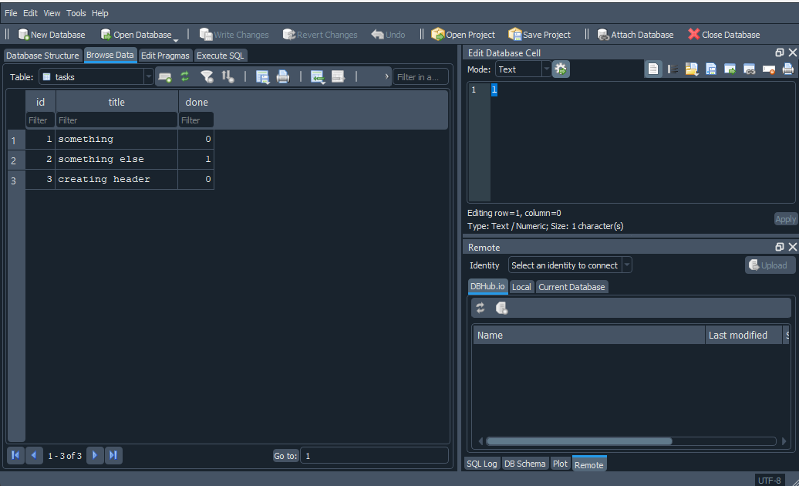

# Todo API

A simple CRUD API for managing tasks, built with FastAPI. Built as part of FlyRank's Backend Engineering Track — Week 2 (in-memory CRUD) and Week 3 (SQLite persistence).

## What this is

A backend REST API that lets you create, read, update, and delete tasks. Data is stored in a **SQLite database** (`tasks.db`), so it survives server restarts — this replaced the original in-memory storage from Week 2.

## How to run it

1. Clone this repo and navigate into it:
   ```bash
   git clone https://github.com/daniyal-devx/todo-api.git
   cd todo-api
   ```

2. Create and activate a virtual environment:
   ```bash
   python -m venv venv
   venv\Scripts\activate       # Windows
   source venv/bin/activate    # Mac/Linux
   ```

3. Install dependencies:
   ```bash
   pip install -r requirements.txt
   ```

4. Run the server:
   ```bash
   uvicorn main:app --reload
   ```

   On first run, this automatically creates `tasks.db` in the project folder, creates the `tasks` table if it doesn't exist, and seeds it with 3 example tasks (only if the table is empty — restarting never duplicates them).

5. Open your browser to `http://localhost:8000/docs` to see the interactive Swagger UI.

## Database

- **Why SQLite:** it's a single file with zero setup — no server to install, no account, no config. It's the simplest way to get real persistence while learning the fundamentals (SQL, parameterized queries, connections) that carry over directly to Postgres later.
- **Where it lives:** `tasks.db`, created automatically in the project root on first run. It's git-ignored, so every fresh clone starts with a brand new, empty database — not the maintainer's test data.
- **How to inspect it:** open `tasks.db` in [DB Browser for SQLite](https://sqlitebrowser.org/) (free) to view or edit rows directly, outside the API.

### Example SQL query

```sql
UPDATE tasks SET done = 1;
```

This marked every task as done directly in the database. Calling `GET /tasks` right after — with no restart and no code change — immediately reflected the change, because the API and DB Browser both read the exact same `tasks.db` file. There's no syncing step; it's one source of truth.

### Database screenshot



## Endpoints

| Method | Path          | Description                             | Success | Errors    |
|--------|---------------|------------------------------------------|---------|-----------|
| GET    | `/`           | API info                                 | 200     | -         |
| GET    | `/health`     | Health check                             | 200     | -         |
| GET    | `/tasks`      | List all tasks                           | 200     | -         |
| POST   | `/tasks`      | Create a new task                        | 201     | 400       |
| GET    | `/tasks/{id}` | Get a single task by id                  | 200     | 404       |
| PUT    | `/tasks/{id}` | Replace a task's title and done status   | 200     | 404, 400  |
| DELETE | `/tasks/{id}` | Delete a task by id                      | 204     | 404       |

All endpoints behave identically to the Week 2 in-memory version — same requests, same responses, same status codes. Only the storage layer underneath changed, from a Python list to SQL queries against `tasks.db`.

## Example request

```bash
curl -i -X POST http://localhost:8000/tasks -H "Content-Type: application/json" -d '{"title":"Buy milk"}'
```

```
HTTP/1.1 201 Created
content-type: application/json

{"id":5,"title":"Buy milk","done":false}
```

## Swagger UI

Full CRUD cycle tested via `/docs`.


## Notes

- Data is stored in SQLite (`tasks.db`) and survives server restarts.
- All SQL queries use parameterized placeholders (`?`) — no user input is ever glued directly into a SQL string, which is what keeps the database safe from injection.
- `title` is validated on both create and update: missing or empty (including whitespace-only) titles return a 400 with a clear error message, handled manually rather than relying on FastAPI's default 422 validation error.

## Persistence proof

After creating tasks and restarting the server (`Ctrl+C`, then `uvicorn main:app --reload` again), `GET /tasks` still returned every task created before the restart — including manual edits made directly in DB Browser. This is the core change from Week 2: back then, restarting reset the task list to the 3 original seeds every time, because the list lived only in memory. Now the data lives on disk in `tasks.db`, so it survives the process stopping and starting.

## AI vs Me — Week 3 (SQLite migration)

### My prompt

> I want you to now move my previous generated CRUD task API from an in memory to real database using SQLite.
>
> Your lane should be Python/FastAPI and for SQLite use the sqlite3 library, with the same three columns in the table tasks: id, title, done.
>
> At startup it should look if the table is missing then create the table, and seed three tasks if and only if the table is empty.
>
> Also the five endpoints previously associated with the in-memory list should now work with the SQLite db file, and also give exceptions same as before, like 400/404.
>
> Also use parameterized queries for safety purposes. Now generate that.

### What it did better

1. **Used a `@contextmanager` for connections** instead of repeating `connect()` / `commit()` / `close()` in every route. One `get_connection()` function, reused everywhere with `with get_connection() as conn:`. This also wraps the connection in a `try/finally`, so it closes even if an error happens mid-request — my version would leak an open connection if an exception hit between opening it and the manual `conn.close()` call.
2. **Used `response_model=Task`** (a Pydantic model) on every route instead of returning hand-built dicts. This makes FastAPI validate and document the exact response shape, and gives cleaner Swagger docs.
3. Added `AUTOINCREMENT` to the primary key for a stricter guarantee against id reuse — a defensible extra I hadn't considered.

### What it got wrong or quietly ignored

1. **PUT became a partial update, not a full replace.** I confirmed this by sending `PUT /tasks/1` with only `{"done": true}` — no `title`. It returned `200 OK` with the old title silently preserved, instead of rejecting the request or requiring both fields. My own implementation (and the assignment spec) treats PUT as a full replacement: both `title` and `done` are required every time. This is the exact same gap the AI made in my Week 2 rematch too — it seems to be a default assumption AI models make about PUT unless explicitly told otherwise.
2. **Error response shape doesn't match mine.** Mine: `{"detail": {"error": "Task not found"}}` (nested). The AI's: `{"detail": "Task not found"}` (flat string). My prompt said to match "400/404... same as before" but never specified the exact JSON shape, so it picked FastAPI's plainer default instead of my nested format.

### What my prompt forgot to specify

- The exact error response shape (`{"detail": {"error": "..."}}` vs a flat string)
- Whether PUT should require both fields (full replace) or allow partial updates
- Whether connections should be opened per-route manually or through a shared helper like a context manager — the AI made its own (arguably better) call here since I left it open

### The rematch

I tightened the prompt to explicitly require: PUT must require both `title` and `done` in every request (400 if either is missing), and all error responses must use the shape `{"detail": {"error": "message"}}`. I regenerated and tested both fixes directly:

- `PUT /tasks/1` with only `{"done": true}` (no title) now correctly returns `400 Bad Request` instead of silently succeeding.
- `GET /tasks/999` now returns the nested shape `{"detail": {"error": "Task with id 999 not found"}}`, matching my own API exactly.

Both issues were fully resolved by specifying them explicitly — confirming the core lesson: an AI's output is only as precise as the spec it's given, and the same silent assumption (partial PUT) showed up twice across two separate rematches, both times because I hadn't ruled it out in the prompt. The rematch version also solved the "both required" rule in an unusual way — it bypassed Pydantic's automatic body validation for that route and parsed the raw JSON manually instead, giving it exact control over which fields to require. A reasonable approach, though it trades away some of Pydantic's built-in type validation to do it.

Both AI attempts (first pass and rematch) are kept in `ai-version-w3/`, separate from my own hand-built Stage 0–5 code. The full diff between my implementation and the AI's first attempt is saved at `ai-version-w3/diff.txt`.

## AI vs Me — Week 2 (in-memory CRUD)

### My original prompt

> You act as a professional backend ai engineer have to build a curd to-do api you have to use pydantic and fast api frameworks and build the api in python like fastapi swagger ui it should have 5 endpoints get / ,get /tasks , get /tasks {id}, post /tasks, put /tasks/{id}, delete /tasks/{id} and with some explicit status codes like if someone gives unknown id or task title empty during some post , put then some explicit status code with some detail it should use in memory storage.

### What the AI did better

Nothing meaningfully outperformed my own implementation — the AI's first attempt was functional but less strict than mine in the places that actually mattered for this assignment (validation, PUT semantics).

### What it got wrong or quietly ignored

1. **Whitespace-only titles were not rejected.** The AI checked `if not task.title:`, which only catches empty strings — a title of `"   "` passed validation and got saved as a task, unlike my own API which strips whitespace before checking.
2. **PUT behaved as a partial update (PATCH), not a full replacement.** My prompt never said whether `PUT` should require both `title` and `done` or allow either to be omitted. The AI defaulted to making both fields optional, silently preserving the old value for any field the client didn't send — a reasonable design choice, but not what REST convention (or my own hand-built version) intends for `PUT`.
3. **Swagger UI showed generic default labels** ("Read Root," "Get Tasks") instead of descriptive summaries, and error responses used a flat string (`"detail": "Title is required"`) instead of my nested `{"detail": {"error": "..."}}` format.

### What my prompt forgot to specify

I never stated the exact status codes to use, that whitespace-only titles count as empty, or whether `PUT` should require both fields. The AI made reasonable-but-different calls on each of these gaps — proof that a vague spec produces a working API, just not the *same* API.

### The rematch

I rewrote the prompt to explicitly require: rejecting whitespace-only titles (not just empty ones), requiring both `title` and `done` on every `PUT` request, and adding descriptive Swagger summaries to each endpoint. Regenerating from this tightened prompt fixed all three issues — the AI's output now matched my own API's behavior exactly.
